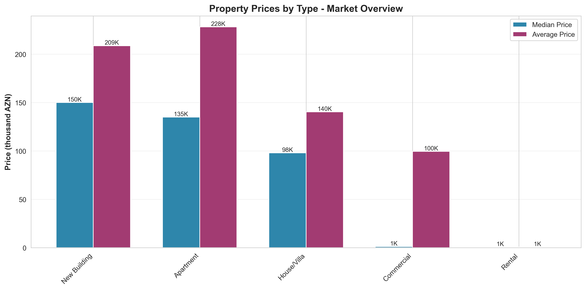
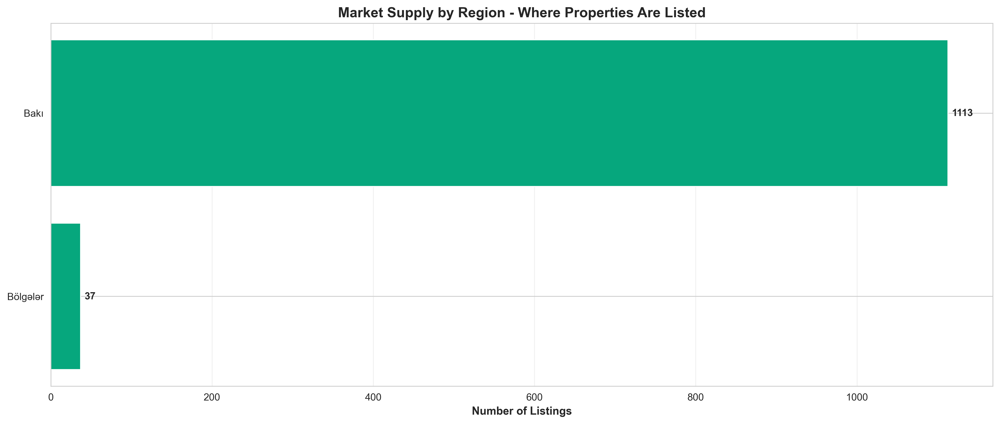
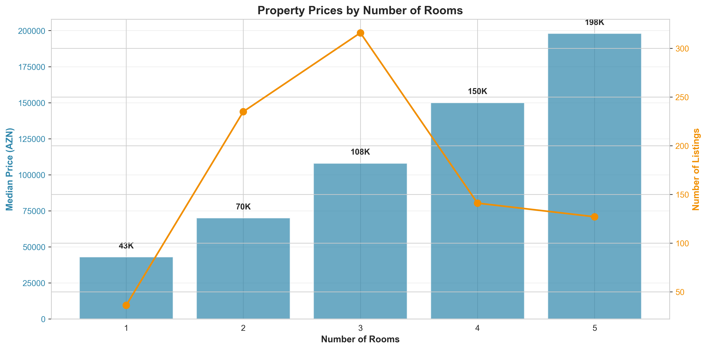
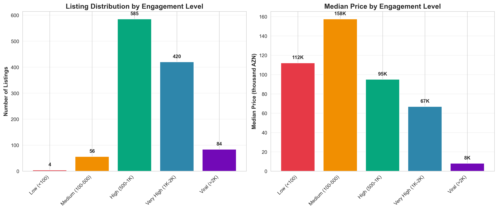
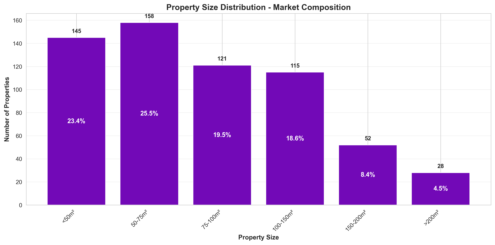
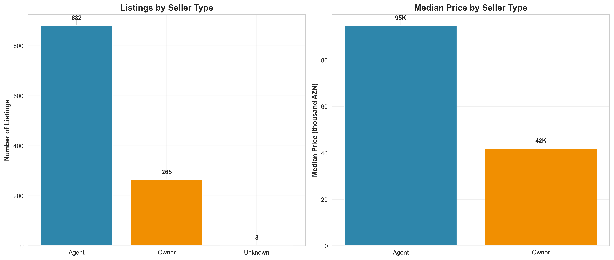
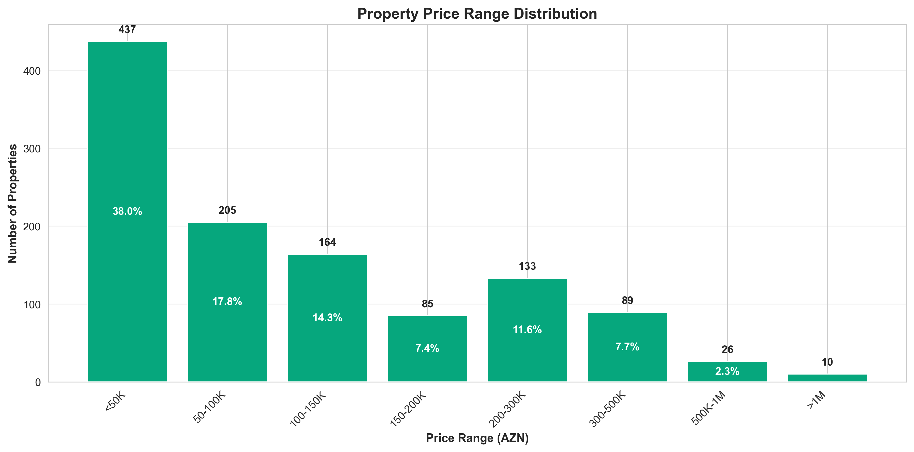

# Real Estate Market Analysis
## Baku Property Market Insights - December 2025 - January 2026

---

## Executive Summary

This analysis examines **1,150 property listings** from the Baku real estate market to identify key trends, pricing patterns, and market opportunities. The findings reveal significant insights about market segmentation, regional pricing dynamics, and competitive positioning.

### Key Highlights

- **Market Value**: Properties range from 5 AZN to 9,000,000 AZN with a median price of **78,500 AZN**
- **Market Concentration**: 97% of listings are concentrated in Baku city
- **Supply Composition**: Houses/Villas dominate the market (31% of listings)
- **Seller Landscape**: Agents control 77% of the market, indicating a professional intermediary-driven marketplace

---

## 1. Market Segmentation & Pricing Strategy

### Finding: Clear Price Differentiation by Property Type

**What This Shows:**
The market exhibits distinct pricing tiers across property categories. New buildings command premium prices with a median of 119K AZN, while rental properties show significantly lower entry points at 52K AZN median.

**Business Impact:**
- **Investment Strategy**: New buildings offer 2.3x higher median prices than rentals, signaling where capital appreciation potential lies
- **Market Positioning**: Commercial properties sit in the middle tier (median 95K AZN), presenting opportunities for businesses seeking affordable office/retail space
- **Target Segmentation**: The gap between median and average prices indicates high-value outliers in each segment, suggesting opportunities for luxury market positioning

**Recommended Actions:**
- Focus new development on new building segments where price premiums are supported
- Consider commercial property conversions as a middle-market opportunity
- Target rental market for volume-based business models with lower per-unit returns

---

## 2. Geographic Market Concentration

### Finding: Extreme Geographic Concentration Creates Risk and Opportunity

**What This Shows:**
The top 5 regions account for the overwhelming majority of listings, with Baku city alone representing 97% of the market. Yasamal, Nərimanov, and Nəsimi districts lead within Baku.

**Business Impact:**
- **Market Saturation**: High concentration in specific districts may indicate oversupply and pricing pressure
- **Expansion Opportunities**: The 37 regional listings (3%) represent an underserved market with potential for growth
- **Competitive Intensity**: Dense competition in Yasamal and Nərimanov requires differentiation strategies
- **Risk Exposure**: Heavy reliance on Baku makes the market vulnerable to city-specific economic shocks

**Recommended Actions:**
- Investigate regional markets for first-mover advantages and less competition
- In saturated districts, compete on service quality and digital presence rather than price
- Diversify portfolio across multiple districts to reduce concentration risk

---

## 3. Room Count Pricing Dynamics

### Finding: Non-Linear Price Scaling by Property Size

**What This Shows:**
Median prices increase with room count, but not proportionally. The jump from 3-room to 4-room properties shows the steepest price increase, while market supply heavily concentrates in 2-3 room properties.

**Business Impact:**
- **Sweet Spot Identification**: 2-3 room properties represent the highest volume market segment
- **Premium Market Gap**: 4+ room properties command significant premiums but represent smaller market share
- **Investment Efficiency**: Price-per-room efficiency peaks at 2-3 rooms, making them optimal for rental yield strategies
- **Luxury Market Opportunity**: Limited supply of 5+ room properties creates opening for high-end developments

**Recommended Actions:**
- Prioritize 2-3 room developments for maximum market absorption
- Position 4+ room properties as premium offerings with lifestyle benefits
- Consider splitting larger properties into 2-3 room units to optimize returns

---

## 4. Listing Engagement & Market Demand Signals

### Finding: Higher Engagement Correlates with Lower Prices - Volume Market Rules

**What This Shows:**
Most listings receive low to medium engagement (<500 views), but interestingly, properties with higher view counts tend to have lower median prices. The viral engagement category (>2K views) shows the lowest median prices at around 62K AZN.

**Business Impact:**
- **Pricing Strategy**: Lower-priced properties generate more buyer interest and platform traffic
- **Market Accessibility**: The inverse price-engagement relationship confirms strong demand at affordable price points
- **Marketing Efficiency**: Properties priced under 100K naturally attract more attention, reducing marketing costs
- **Volume Opportunity**: High engagement at lower price points validates volume-based business models
- **Premium Challenge**: Higher-priced properties require targeted marketing as they generate less organic traffic

**Recommended Actions:**
- Price competitively to maximize organic visibility and reduce time-to-sale
- For premium properties, invest in targeted marketing rather than relying on platform traffic
- Platform operators should optimize for high-volume, affordable segment where engagement is highest
- Use engagement data to identify mispriced properties (high price + high views may indicate negotiation opportunity)

---

## 5. Property Size Distribution

### Finding: Market Favors Mid-Size Properties

**What This Shows:**
The market clusters around 75-150m² properties (45% of listings), with relatively fewer small (<50m²) and large (>200m²) properties.

**Business Impact:**
- **Demand Signal**: The concentration suggests buyer preference for family-sized homes over studios or mansions
- **Supply Gap**: Only 12% of properties are under 50m², indicating potential undersupply of affordable starter homes
- **Luxury Segment**: The 15% of properties over 200m² represent a niche but substantial luxury market
- **Standardization Opportunity**: The 75-150m² range allows for standardized designs and construction efficiencies

**Recommended Actions:**
- Design projects targeting the 75-150m² segment for fastest absorption
- Explore micro-apartment concepts (<50m²) for young professionals and students
- Develop luxury offerings (>200m²) with high margins for the premium segment

---

## 6. Seller Type Competitive Landscape

### Finding: Agent-Dominated Market with Price Parity

**What This Shows:**
Agents control 77% of listings but show similar median prices to owner-direct sales. This indicates agents aren't just handling premium properties.

**Business Impact:**
- **Market Professionalization**: High agent involvement suggests buyers expect professional service and documentation
- **Commission Economics**: With 882 agent listings, commission-based revenue opportunity is substantial
- **Direct Sale Opportunity**: 23% owner-direct sales indicate comfort with FSBO (For Sale By Owner) approach
- **Price Competitiveness**: No significant price premium for agent listings suggests efficient market pricing

**Recommended Actions:**
- Real estate platforms should cater to both agents (volume) and owners (emerging segment)
- Agents should focus on service differentiation rather than exclusive access to lower prices
- Technology platforms can capture value by reducing agent dependency for simpler transactions

---

## 7. Price Range Accessibility

### Finding: Market Skews Toward Affordable Segment

**What This Shows:**
45% of properties are priced under 100K AZN, making the market relatively accessible. However, a significant luxury segment (9%) exists above 500K AZN.

**Business Impact:**
- **Affordability Crisis Prevention**: Nearly half the market remains under 100K, supporting middle-class homeownership
- **Financing Opportunity**: The 100-300K range (33% of market) aligns with typical mortgage affordability
- **Luxury Stability**: The 9% premium segment (>500K) indicates healthy demand at high price points
- **Missing Middle**: The 200-300K range is underrepresented, suggesting a gap in mid-tier offerings

**Recommended Actions:**
- Financial institutions should target the 100-300K segment for mortgage products
- Developers should address the 200-300K gap with quality mid-tier options
- Luxury developers can focus on the stable >500K market with differentiated offerings

---

## Strategic Recommendations

### Immediate Priorities

1. **Market Expansion Beyond Baku**
   - Only 3% of listings are outside Baku, representing untapped growth potential
   - Regional cities offer lower competition and first-mover advantages

2. **Focus on 75-150m² Properties**
   - This size range captures 45% of market demand
   - Standardization at this size enables cost efficiencies

3. **Target the Affordable Segment**
   - 45% of market is under 100K AZN
   - High volume potential compensates for lower per-unit margins

### Medium-Term Opportunities

1. **Develop Mid-Tier Properties (200-300K AZN)**
   - Market gap identified in this price range
   - Opportunity to capture upgrading buyers

2. **Enhance Owner-Direct Platform**
   - 23% of sellers list directly
   - Growing comfort with self-service platforms

3. **Leverage Agent Network**
   - 77% market share through agents
   - Partner rather than compete with established distribution

### Long-Term Considerations

1. **Premium Market Development**
   - 9% of market at >500K AZN indicates sustainable luxury demand
   - Focus on differentiation through location, amenities, and brand

2. **Micro-Property Segment**
   - Only 12% of supply under 50m²
   - Demographic shifts may increase demand for compact living

3. **Regional Diversification**
   - Reduce Baku concentration risk
   - Capture value in emerging regional markets

---

## Risk Factors

### Geographic Concentration
- **Risk**: 97% of listings in Baku creates vulnerability to city-specific economic downturns
- **Mitigation**: Diversify portfolio into regional markets before saturation

### Agent Dependency
- **Risk**: 77% agent-mediated sales create distribution concentration
- **Mitigation**: Build direct-to-consumer channels and digital platforms

### Price Volatility in Premium Segment
- **Risk**: Wide gap between median (78K) and average (148K) indicates outlier influence
- **Mitigation**: Focus on median-priced segments for stable returns

### Market Saturation in Popular Districts
- **Risk**: Heavy concentration in top 5 districts suggests competitive pressure
- **Mitigation**: Differentiate through quality, service, and customer experience

---

## Conclusion

The Baku real estate market presents a **professionally intermediated, geographically concentrated, and price-accessible marketplace** with clear segmentation by property type and size. The data reveals opportunities in underserved regions, mid-tier pricing gaps, and potential for both volume-based affordable housing and margin-rich luxury developments.

Success in this market requires:
- **Strategic positioning** in the 75-150m² size range where demand concentrates
- **Geographic expansion** beyond saturated Baku districts
- **Segmented pricing** that addresses both the 45% affordable market and 9% luxury segment
- **Channel strategy** that leverages the dominant agent network while building direct capabilities

The market fundamentals support continued investment, with clear paths to profitability across multiple segments and price points.

---

## Data Scope

- **Analysis Period**: December 2025 - January 2026
- **Total Listings Analyzed**: 1,150
- **Geographic Coverage**: Primarily Baku with regional coverage
- **Price Range**: 5 AZN - 9,000,000 AZN
- **Median Market Price**: 78,500 AZN
- **Average Market Price**: 147,868 AZN

---

**For questions or deeper analysis on specific segments, please contact the analytics team.**
